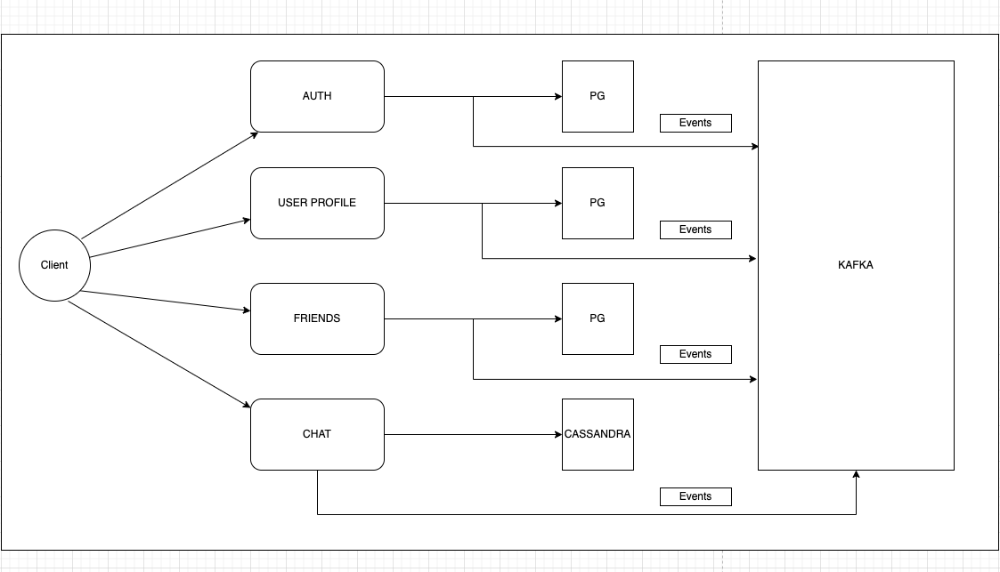

# gRPC Chat App

This is a chat application comprising of several components communicating to each other with the help of Kafka. In other words, this is an example of microservice app. Why is it better than many other examples? Well, because these microservices are independent of each other and each one of them rely on their own database. This approach gives you flexibility if one of the system goes down.

The app allow users to signup, add friends and chat with them in real-time with the help of gRPC.

## Components

1. [Frontend](/frontend) TODO
2. [Auth](/backend/services/auth) is written in Go and provides authorization functionality. Generates JWT tokens to be used with other APIs.
3. [User](/backend/services/user) is written with Go, provides CRUD functionality over user's personal details such as name and enail.
4. [Friends](/backend/services/friends) allows users to send a friend requests and view other requests.
5. [Chat](/backend/services/chat) is written in Go leveraging Bi-Directional Calls to push the messages to the users.


Take a look at the components diagram that describes them and their interactions.



## How to start

The easiest way is to use `docker-compose`:

```
docker-compose up --build
```

## Contribution

This is definitely a contrived project, so it can be extended in any way you want.

## License

MIT